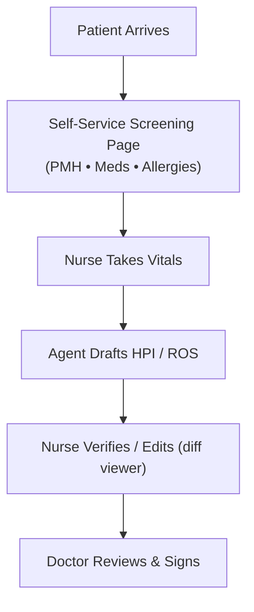

# Pre-Examination Charting Agent 🚑🩺  
"Cursor-style" AI assistant that handles patient screening, vitals capture, and draft-note generation while keeping nurses & doctors firmly in the verification loop.

## 🎯 Current Status
**Phase:** Architecture & Frontend Planning  
**Stack Finalized:** Open-source focused with Firebase + React + GPT-4  
**Next:** Begin frontend scaffolding with prepared prompts  

## 1. Why It Matters
• Nurses spend 30-40% of every visit on repetitive data entry (PMH, meds, vitals).  
• Context often gets lost between kiosk check-in → vitals → note drafting.  
• Our agent preserves that context, drafts the note, and shows transparent diffs so humans verify quickly.

## 2. End-to-End Workflow


## 3. Key Features
1. **Screening Page (Tablet/Kiosk)** – collects PMH, meds, allergies, social/family history and stores JSON.  
2. **Vitals Capture** – nurse inputs vitals, coloured heat-map flags out-of-range values.  
3. **Agent Draft** – LLM ingests screening JSON + vitals → drafts HPI/ROS and safety checklist.  
4. **Verification UI** – split-view: generated note ⬅️➡️ highlighted source snippets, diff modal for edits.  
5. **Autonomy Slider** – OFF / ASSIST / AUTO (confidence-gated) modes.  
6. **Audit Log & De-ID** – every input/output stored, PHI hashed before LLM calls.  
7. **Mermaid Diagram Hotkey** – `Ctrl-M` autogenerates the visit workflow diagram for hand-offs.  
8. **Automated Workflows** – n8n-powered visit transcript processing with EHR integration and nursing notifications.

## 4. Technical Stack (Open Source + Free Tier)
### Frontend
• **React + TypeScript** – Modern, type-safe UI development  
• **Vite** – Fast build tool and dev server  
• **Material-UI v5** – Medical-grade component library  
• **React Hook Form** – Form validation and state management  
• **React Diff Viewer** – Side-by-side note comparison  
• **Zustand** – Lightweight state management  

### Backend & Data
• **Firebase** ☁️ – Auth, Firestore, Cloud Functions (free tier)  
• **LangChain** – AI orchestration and prompt management  
• **OpenAI GPT-4** – Note generation (only paid service)  
• **Chroma** – Vector database for semantic search (self-hosted)  

### Workflow & Automation
• **n8n** – Visual workflow automation (self-hosted)  
• **Presidio** – Open-source PHI de-identification  
• **Sentry** – Error tracking (free tier)  

### DevOps
• **GitHub Actions** – CI/CD pipeline  
• **Docker Compose** – Local development environment  
• **Firebase Hosting** – Static site deployment  
• **Grafana + Prometheus** – Monitoring (self-hosted)  

## 5. Repository Layout
```
pre-exam-charting-agent/
│
├── app/                    # React frontend
│   ├── src/
│   │   ├── components/     # UI components
│   │   ├── pages/          # Route pages
│   │   ├── hooks/          # Custom React hooks
│   │   ├── services/       # API and Firebase
│   │   ├── stores/         # Zustand state
│   │   └── types/          # TypeScript types
├── agent/                  # LLM prompts, memory, tools
│   └── prompt_templates/
├── data/                   # synthetic sample patients
├── docs/                   # architecture diagrams, mermaid
│   ├── BrainLift.md        # Knowledge hub
│   ├── frontend-setup-prompts.md  # Figma design system prompts
│   ├── automation-workflows.md    # n8n workflows & EHR integration
│   └── n8n-workflow-setup.md     # Complete n8n setup guide
├── tests/                  # pytest suite
├── scripts/seed_data.py    # generate test patients
├── .github/workflows/ci.yml
├── .gitignore
├── LICENSE                 # MIT
├── README.md
└── Makefile                # dev-up / demo commands
```

## 6. Milestone Timeline (1-Week Sprint)
**Day 1** ✅ – Project setup, tech stack finalization, frontend prompts prepared  
**Day 2** 🔄 – Scaffold React app, implement Screening Page stub, commit JSON schema  
**Days 3-4** – Build Agent draft + verification UI (happy path)  
**Day 5** – Add autonomy slider, audit log, diff viewer  
**Day 6** – Polish UI, seed synthetic patients, write docs  
**Day 7** – Rehearse 5-min demo, tag `v0.1.0`, push social post  

## 7. Development Setup
```bash
# Clone the repository
git clone https://github.com/Duraman3444/PreExamChartingAgent.git
cd PreExamChartingAgent

# Frontend setup (coming soon)
cd app
npm install
npm run dev

# Backend setup (coming soon)
make dev-up     # creates .venv & installs Python deps
make demo       # seeds data & launches full app
```

## 8. Current Progress & Next Steps
### ✅ Completed
- [x] Project architecture and tech stack decisions
- [x] Open-source tooling research and selection
- [x] Frontend setup prompts prepared (10 comprehensive prompts)
- [x] Repository structure and documentation

### 🔄 In Progress
- [ ] React TypeScript project scaffolding
- [ ] Firebase configuration and security rules
- [ ] Patient screening interface components

### 📋 Upcoming
- [ ] Vitals capture interface
- [ ] AI draft verification with diff viewer
- [ ] LangChain integration and prompt engineering
- [ ] n8n workflow automation setup
- [ ] Testing framework and CI/CD pipeline

## 9. Key Design Decisions
- **Open Source First**: All tools are open-source except GPT-4 API
- **Firebase for Speed**: Rapid prototyping with generous free tier
- **React + TypeScript**: Type safety for medical data handling
- **Self-Hosted Options**: Can migrate to fully self-hosted stack later
- **Privacy by Design**: PHI de-identification before any external API calls

## 10. Contributing
This is an open-source project welcoming contributions! See our [BrainLift knowledge hub](docs/BrainLift.md) for technical resources and decision rationale.

### Quick Start for Contributors
1. Review the frontend setup prompts in `docs/frontend-setup-prompts.md`
2. Pick a component from the current sprint backlog
3. Follow the established patterns for TypeScript, testing, and documentation
4. Submit PR with clear description and test coverage

---

_Building the future of medical documentation, one commit at a time._ 🚀

**Live Demo:** Coming soon  
**Documentation:** [BrainLift Knowledge Hub](docs/BrainLift.md) | [Automation Workflows](docs/automation-workflows.md) | [n8n Setup Guide](docs/n8n-workflow-setup.md)  
**Issues:** [GitHub Issues](https://github.com/Duraman3444/PreExamChartingAgent/issues)
