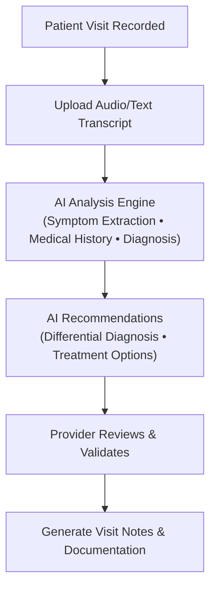

# Visit Transcript Analysis & AI Diagnosis Assistance 🩺🤖  
AI-powered platform that analyzes patient visit transcripts to assist healthcare providers with diagnosis and treatment recommendations.

## 🎯 Current Status
**Phase:** Architecture & Frontend Planning  
**Stack Finalized:** React + TypeScript + Firebase + OpenAI GPT-4  
**Next:** Begin frontend development with visit transcript upload and AI analysis features  

## 1. Why It Matters
• Healthcare providers spend significant time analyzing patient visit recordings for diagnosis and treatment planning  
• Important symptoms and context can be missed during manual transcript review  
• Our AI assistant extracts key symptoms, suggests differential diagnoses, and provides treatment recommendations  
• Focus: Transform visit transcripts into actionable clinical insights while maintaining provider control

## 2. End-to-End Workflow


## 3. Key Features
1. **Transcript Upload** – Support for audio files (MP3, WAV, M4A) and text transcripts (TXT, DOCX, PDF)  
2. **AI Symptom Extraction** – Automatically identifies and categorizes symptoms from visit transcripts  
3. **Medical History Parsing** – Extracts medications, allergies, conditions, and relevant history  
4. **Differential Diagnosis** – AI-generated diagnosis suggestions with probability scores and reasoning  
5. **Treatment Recommendations** – Evidence-based treatment options with contraindications and alternatives  
6. **Clinical Decision Support** – Red flag detection, drug interaction alerts, and urgent referral recommendations  
7. **Visit Documentation** – Automated SOAP note generation from AI analysis  
8. **Provider Validation** – Human-in-the-loop review and approval of all AI recommendations  

## 4. Technical Stack
### Frontend
• **React + TypeScript** – Modern, type-safe UI development  
• **Vite** – Fast build tool and development server  
• **Material-UI v5** – Professional healthcare UI components  
• **React Hook Form** – Form validation and state management  
• **Zustand** – Lightweight state management  

### Backend & AI
• **Firebase** ☁️ – Authentication, Firestore database, Cloud Storage  
• **OpenAI GPT-4** – Advanced language model for medical text analysis  
• **Firebase Functions** – Serverless API endpoints  
• **Audio Processing** – Speech-to-text transcription services  

### Data & Security
• **HIPAA Compliance** – End-to-end encryption and secure data handling  
• **PHI Protection** – Data anonymization for AI processing  
• **Audit Logging** – Complete audit trail for all user actions  
• **Role-Based Access** – Provider-specific permissions and access controls  

## 5. Repository Layout
```
PreExamChartingAgent/
│
├── app/                    # React frontend
│   ├── src/
│   │   ├── components/     # UI components
│   │   │   ├── layout/     # Header, sidebar, layout
│   │   │   └── common/     # Shared components
│   │   ├── pages/          # Route pages (Dashboard, Visits, etc.)
│   │   ├── hooks/          # Custom React hooks
│   │   ├── services/       # API and Firebase services
│   │   ├── stores/         # Zustand state management
│   │   ├── types/          # TypeScript type definitions
│   │   └── utils/          # Utility functions
├── docs/                   # Project documentation
│   ├── data-model.md              # Complete data model specifications
│   ├── PRD-Medical-Charting-App.md  # Product Requirements Document
│   ├── frontend-setup-prompts.md    # Development setup guides
│   ├── automation-workflows.md      # AI processing workflows
│   ├── wireflow-diagrams.md        # User flow diagrams
│   ├── ui-concepts.md               # UI design system
│   ├── user-personas.md             # User profiles & use cases
│   └── industry-context.md          # Market analysis
├── .github/workflows/      # CI/CD pipelines
├── .gitignore
├── LICENSE
└── README.md
```

## 6. Data Model Overview
### Core Entities
- **Patients** – Basic demographics and medical history from conversations
- **Visits** – Visit records with transcripts and AI analysis
- **Visit Transcripts** – Audio/text processing with speaker identification
- **AI Analysis** – Symptom extraction, diagnosis suggestions, treatment recommendations
- **Visit Notes** – Generated documentation and provider notes
- **Users** – Healthcare providers with role-based access

### AI Analysis Components
- **Extracted Symptoms** – Identified symptoms with severity and context
- **Patient History** – Medications, allergies, conditions from transcript
- **Diagnosis Options** – Differential diagnosis with probability scores
- **Treatment Recommendations** – Evidence-based treatment suggestions
- **Concern Flags** – Red flags and clinical alerts
- **Follow-up Recommendations** – Next steps and monitoring plans

## 7. Development Roadmap
### Phase 1: Foundation (Months 1-2)
- [x] Project refactoring and architecture planning
- [x] Data model design and documentation
- [x] Frontend scaffolding and routing
- [ ] User authentication and basic patient management
- [ ] Visit creation and transcript upload UI

### Phase 2: Core AI Features (Months 3-4)
- [ ] Transcript processing and AI analysis engine
- [ ] Symptom extraction and medical history parsing
- [ ] Differential diagnosis recommendations
- [ ] Treatment suggestions and clinical decision support

### Phase 3: Advanced Features (Months 5-6)
- [ ] Visit documentation and note generation
- [ ] Provider review and validation workflows
- [ ] Reporting and analytics dashboard
- [ ] Advanced AI features and model refinement

## 8. Development Setup
```bash
# Clone the repository
git clone https://github.com/Duraman3444/PreExamChartingAgent.git
cd PreExamChartingAgent

# Frontend setup
cd app
npm install
npm run dev

# Firebase setup (coming soon)
# - Create Firebase project
# - Configure authentication
# - Set up Firestore database
# - Configure Cloud Storage
```

## 9. Current Progress & Next Steps
### ✅ Completed
- [x] Project refactoring to focus on visit transcript analysis
- [x] Complete data model redesign for AI-powered analysis
- [x] Frontend architecture updates (routes, components, types)
- [x] Product Requirements Document (PRD) rewrite
- [x] Updated navigation and dashboard for new scope
- [x] Git repository with comprehensive documentation

### 🔄 Next Priority Tasks
1. **Firebase Configuration** – Set up authentication, Firestore, and Cloud Storage
2. **Visit Management UI** – Create visit list, detail, and creation pages
3. **Transcript Upload** – File upload component with validation and progress
4. **AI Analysis Integration** – Connect to OpenAI API for transcript analysis
5. **Provider Dashboard** – Display AI recommendations and review interface

### 📋 Upcoming Features
- [ ] Audio transcription service integration
- [ ] Symptom extraction and categorization
- [ ] Differential diagnosis generation
- [ ] Treatment recommendation engine
- [ ] Visit note generation and export

## 10. Key Design Decisions
- **AI-First Approach**: Leverage advanced language models for medical analysis
- **Provider-Controlled**: All AI recommendations require human validation
- **Transcript-Focused**: Specialize in visit recording analysis rather than comprehensive EMR
- **HIPAA Compliant**: Security and privacy by design
- **Scalable Architecture**: Built for growth with modern cloud infrastructure

## 11. Getting Started Development
### Immediate Next Steps:
1. **Set up Firebase project** with authentication and Firestore
2. **Create visit management pages** (list, detail, create)
3. **Implement transcript upload** with file validation
4. **Build AI analysis display** components
5. **Add provider review workflows**

### Development Workflow:
```bash
# Start development server
cd app && npm run dev

# Access application at http://localhost:5173
# Login with test credentials (to be configured)
```

## 12. Contributing
This project focuses on AI-powered clinical decision support through visit transcript analysis. We welcome contributions that enhance diagnostic accuracy and provider workflow efficiency.

### Quick Start for Contributors
1. Review the data model in `docs/data-model.md`
2. Check the PRD for feature requirements
3. Follow TypeScript and React best practices
4. Ensure HIPAA compliance in all implementations
5. Submit PRs with clear descriptions and test coverage

---

_Transforming patient visit transcripts into actionable clinical insights with AI._ 🚀

**Documentation:** [Data Model](docs/data-model.md) | [PRD](docs/PRD-Medical-Charting-App.md) | [UI Design](docs/ui-concepts.md) | [User Personas](docs/user-personas.md)  
**Issues:** [GitHub Issues](https://github.com/Duraman3444/PreExamChartingAgent/issues)  
**License:** MIT
