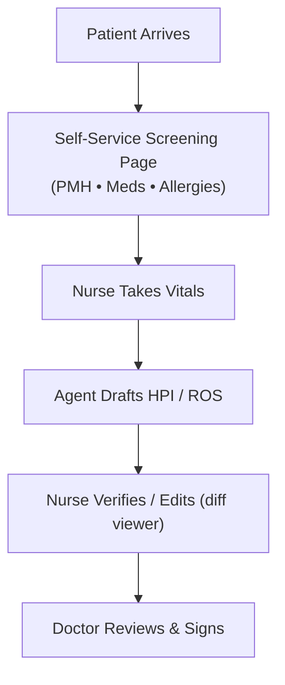

# Pre-Examination Charting Agent 🚑🩺  
"Cursor-style" AI assistant that handles patient screening, vitals capture, and draft-note generation while keeping nurses & doctors firmly in the verification loop.

## 1. Why It Matters
• Nurses spend 30-40 % of every visit on repetitive data entry (PMH, meds, vitals).  
• Context often gets lost between kiosk check-in → vitals → note drafting.  
• Our agent preserves that context, drafts the note, and shows transparent diffs so humans verify quickly.

## 2. End-to-End Workflow


## 3. Key Features
1. **Screening Page (Tablet/Kiosk)** – collects PMH, meds, allergies, social/family history and stores JSON.  
2. **Vitals Capture** – nurse inputs vitals, coloured heat-map flags out-of-range values.  
3. **Agent Draft** – LLM ingests screening JSON + vitals → drafts HPI/ROS and safety checklist.  
4. **Verification UI** – split-view: generated note ⬅️➡️ highlighted source snippets, diff modal for edits.  
5. **Autonomy Slider** – OFF / ASSIST / AUTO (confidence-gated) modes.  
6. **Audit Log & De-ID** – every input/output stored, PHI hashed before LLM calls.  
7. **Mermaid Diagram Hotkey** – `Ctrl-M` autogenerates the visit workflow diagram for hand-offs.

## 4. Technical Stack
• Front-end: Streamlit (hack-week quick) or React + Material-UI (stretch).  
• LLM Interface: LangChain + OpenAI GPT-4o (swap-able).  
• Context Store: In-memory JSON (Pinecone or Postgres vector DB later).  
• Diff Viewer: `react-diff-viewer` (green/red chunk diff).  
• CI: GitHub Actions – lint + pytest.  

## 5. Repository Layout
```
pre-exam-charting-agent/
│
├── app/                    # UI (Streamlit or React)
├── agent/                  # LLM prompts, memory, tools
│   └── prompt_templates/
├── data/                   # synthetic sample patients
├── docs/                   # architecture diagrams, mermaid
├── tests/                  # pytest suite
├── scripts/seed_data.py    # generate test patients
├── .github/workflows/ci.yml
├── .gitignore
├── LICENSE                 # MIT
├── README.md
└── Makefile                # dev-up / demo commands
```

## 6. Milestone Timeline (1-Week Sprint)
Day 1 – user interviews, scope, write one-pager "Current vs. Agent workflow"  
Day 2 – scaffold repo, implement Screening Page stub, commit JSON schema  
Days 3-4 – build Agent draft + verification UI (happy path)  
Day 5 – add autonomy slider, audit log, diff viewer  
Day 6 – polish UI, seed synthetic patients, write docs  
Day 7 – rehearse 5-min demo, tag `v0.1.0`, push social post

## 7. How to Run Locally
```bash
git clone git@github.com:<your-org>/pre-exam-charting-agent.git
cd pre-exam-charting-agent
make dev-up     # creates .venv & installs Python + (optional) front-end deps
make demo       # seeds data & launches the full app at http://localhost:8501
```

## 8. Immediate Next Steps
1. **Clone & install** (see above).  
2. **Fill `requirements.txt`** – `streamlit langchain openai python-dotenv` …  
3. **Implement `app/screens.py`** – fields for PMH, meds, allergies.  
4. **Write first prompt** (`agent/draft_note.py`) that merges screening JSON + vitals.  
5. **Push a PR** – CI should pass (`pytest -q`).  
6. **Update `docs/architecture.md`** with the mermaid flow and sequence diagram.

---

_Copy, paste, tweak—now everyone's on the same page!_ 