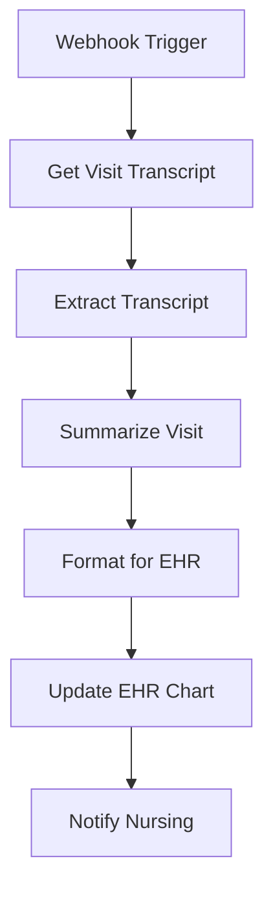

# Automation Workflows Documentation 🔄

*This document outlines the automated workflows for the Pre-Examination Charting Agent, including visit transcript processing and EHR integration.*

---

## Overview

The Pre-Examination Charting Agent includes automated workflows that process patient visit transcripts and update electronic health records (EHR) systems. These workflows are designed to reduce manual data entry, improve accuracy, and ensure timely nursing notifications.

## Architecture Components

### 1. Webhook-Based Trigger System
- **Purpose**: Initiates the workflow when patient visits are completed
- **Integration**: Connects with existing healthcare systems via REST API
- **Security**: Implements authentication and authorization protocols

### 2. AI-Powered Summarization
- **Model**: GPT-4o-mini for medical accuracy and cost efficiency
- **Temperature**: 0.2 for consistent, reliable outputs
- **Specialization**: Trained prompts for medical chart notes and nursing instructions

### 3. EHR Integration
- **Method**: RESTful API integration with existing EHR systems
- **Data Format**: Standardized medical terminology and formats
- **Validation**: Ensures data integrity and compliance

---

## Workflow Diagram



## Workflow Steps

### Step 1: Webhook Trigger
- **Trigger**: POST request to `/patient-charting` endpoint
- **Input**: Patient ID, Visit ID, EHR API URL
- **Authentication**: Bearer token or API key authentication
- **Response**: Immediate acknowledgment for async processing

### Step 2: Get Visit Transcript
- **Action**: Retrieves complete visit transcript from EHR system
- **API Call**: `GET /patients/{patientId}/visits/{visitId}/transcript`
- **Error Handling**: Retry logic for network failures
- **Timeout**: 30-second timeout with exponential backoff

### Step 3: Extract Transcript
- **Process**: Parses and validates transcript data
- **Data Cleaning**: Removes metadata, formatting artifacts
- **Validation**: Ensures transcript completeness and format

### Step 4: Summarize Visit
- **AI Model**: GPT-4o-mini with medical specialization
- **System Prompt**: "You are a medical assistant. Summarize the patient visit transcript and provide concise chart notes and next nursing steps."
- **Output**: Structured summary with:
  - Visit summary
  - Key findings
  - Next nursing steps
  - Recommendations

### Step 5: Format for EHR
- **Process**: Converts AI summary to EHR-compatible format
- **Data Extraction**: Separates chart notes from nursing instructions
- **Standardization**: Applies medical terminology standards
- **Validation**: Ensures data integrity and completeness

### Step 6: Update EHR Chart
- **API Call**: `PATCH /patients/{patientId}/visits/{visitId}/chart`
- **Payload**: Chart notes and nursing instructions
- **Validation**: Confirms successful update
- **Audit Trail**: Logs all changes for compliance

### Step 7: Notify Nursing
- **Method**: Slack notification to nursing team
- **Channel**: #nursing-updates
- **Content**: Patient ID, visit ID, and next steps
- **Escalation**: Critical findings trigger immediate alerts

---

## n8n Workflow Configuration

### Workflow JSON
```json
{
  "nodes": [
    {
      "parameters": {
        "httpMethod": "POST",
        "path": "patient-charting",
        "responseMode": "onReceived"
      },
      "name": "Webhook Trigger",
      "type": "n8n-nodes-base.webhook",
      "typeVersion": 1,
      "position": [250, 300]
    },
    {
      "parameters": {
        "authentication": "predefinedCredentialType",
        "url": "={{ $json[\"ehrApiUrl\"] }}/patients/{{$json.patientId}}/visits/{{$json.visitId}}/transcript",
        "options": {}
      },
      "name": "Get Visit Transcript",
      "type": "n8n-nodes-base.httpRequest",
      "typeVersion": 1,
      "position": [450, 300]
    },
    {
      "parameters": {
        "mode": "passThrough",
        "destinationKey": "transcript"
      },
      "name": "Extract Transcript",
      "type": "n8n-nodes-base.set",
      "typeVersion": 1,
      "position": [650, 300]
    },
    {
      "parameters": {
        "model": "gpt-4o-mini",
        "temperature": 0.2,
        "messages": [
          {
            "role": "system",
            "content": "You are a medical assistant. Summarize the patient visit transcript and provide concise chart notes and next nursing steps."
          },
          {
            "role": "user",
            "content": "{{$node[\"Extract Transcript\"].json.transcript}}"
          }
        ]
      },
      "name": "Summarize Visit",
      "type": "n8n-nodes-base.openAI",
      "typeVersion": 1,
      "position": [850, 300]
    },
    {
      "parameters": {
        "functionCode": "// Prepare payload for EHR update\nreturn [{\n  json: {\n    patientId: $json.patientId,\n    visitId: $json.visitId,\n    chartSummary: $node['Summarize Visit'].json.choices[0].message.content,\n    nextSteps: extractNextSteps($node['Summarize Visit'].json.choices[0].message.content)\n  }\n}];\n\nfunction extractNextSteps(summary) {\n  const match = summary.match(/Next Steps[:\\-\\s]*([\\s\\S]*)/i);\n  return match ? match[1].trim() : '';\n}"
      },
      "name": "Format for EHR",
      "type": "n8n-nodes-base.function",
      "typeVersion": 1,
      "position": [1050, 300]
    },
    {
      "parameters": {
        "authentication": "predefinedCredentialType",
        "url": "={{ $json.ehrApiUrl }}/patients/{{$json.patientId}}/visits/{{$json.visitId}}/chart",
        "method": "PATCH",
        "jsonParameters": true,
        "options": {},
        "bodyParametersJson": "={{ { chartNotes: $json.chartSummary, nursingInstructions: $json.nextSteps } }}"
      },
      "name": "Update EHR Chart",
      "type": "n8n-nodes-base.httpRequest",
      "typeVersion": 1,
      "position": [1250, 300]
    },
    {
      "parameters": {
        "channel": "#nursing-updates",
        "text": "Patient {{$json.patientId}} visit {{$json.visitId}} chart updated. Next nursing steps: {{$json.nextSteps}}"
      },
      "name": "Notify Nursing",
      "type": "n8n-nodes-base.slack",
      "typeVersion": 1,
      "position": [1450, 300]
    }
  ],
  "connections": {
    "Webhook Trigger": { "main": [[{"node": "Get Visit Transcript", "type": "main", "index": 0}]] },
    "Get Visit Transcript": { "main": [[{"node": "Extract Transcript", "type": "main", "index": 0}]] },
    "Extract Transcript": { "main": [[{"node": "Summarize Visit", "type": "main", "index": 0}]] },
    "Summarize Visit": { "main": [[{"node": "Format for EHR", "type": "main", "index": 0}]] },
    "Format for EHR": { "main": [[{"node": "Update EHR Chart", "type": "main", "index": 0}]] },
    "Update EHR Chart": { "main": [[{"node": "Notify Nursing", "type": "main", "index": 0}]] }
  }
}
```

### Node Configuration Details

#### Webhook Trigger Node
- **Type**: `n8n-nodes-base.webhook`
- **Method**: POST
- **Path**: `patient-charting`
- **Response Mode**: On received
- **Authentication**: Configurable via n8n credentials

#### HTTP Request Nodes
- **Authentication**: Uses predefined credential types
- **Timeout**: 30 seconds default
- **Retry Logic**: Automatic retry on network failures
- **Error Handling**: Propagates errors to workflow error handling

#### OpenAI Node
- **Model**: GPT-4o-mini
- **Temperature**: 0.2 for consistent outputs
- **System Prompt**: Medical assistant specialization
- **Rate Limiting**: Handled by OpenAI API

#### Function Node
- **Purpose**: Data transformation and extraction
- **Language**: JavaScript
- **Error Handling**: Try-catch blocks for parsing
- **Output**: Structured data for EHR update

#### Slack Node
- **Channel**: #nursing-updates
- **Message Format**: Structured notification
- **Mentions**: Configurable for urgent cases
- **Attachments**: Can include chart summaries

---

## Integration Requirements

### Prerequisites
1. **n8n Installation**: Self-hosted or cloud instance
2. **API Credentials**: OpenAI API key
3. **EHR System**: RESTful API access
4. **Slack Workspace**: Bot token and channel access
5. **Network Access**: Secure communication channels

### Environment Variables
```bash
# OpenAI Configuration
OPENAI_API_KEY=your_openai_api_key
OPENAI_MODEL=gpt-4o-mini

# EHR System Configuration
EHR_API_BASE_URL=https://your-ehr-system.com/api
EHR_API_KEY=your_ehr_api_key

# Slack Configuration
SLACK_BOT_TOKEN=your_slack_bot_token
SLACK_CHANNEL=#nursing-updates

# Workflow Configuration
WEBHOOK_PATH=patient-charting
WORKFLOW_TIMEOUT=300
```

### Security Considerations
1. **Authentication**: All API calls use secure authentication
2. **HTTPS**: All communications encrypted in transit
3. **Rate Limiting**: Implements proper rate limiting
4. **Data Privacy**: PHI handling compliant with HIPAA
5. **Audit Logging**: Complete audit trail for all operations

---

## Monitoring and Maintenance

### Performance Metrics
- **Processing Time**: Average workflow execution time
- **Success Rate**: Percentage of successful completions
- **Error Rate**: Categorized error tracking
- **API Response Times**: Monitor external API performance

### Alerting
- **Workflow Failures**: Immediate alerts for critical failures
- **API Timeouts**: Monitoring for external service issues
- **Data Quality**: Alerts for incomplete or invalid data
- **Volume Monitoring**: Track processing volume and capacity

### Maintenance Tasks
1. **Regular Updates**: Keep n8n and node versions updated
2. **Credential Rotation**: Rotate API keys and tokens
3. **Performance Tuning**: Optimize workflow execution
4. **Backup**: Regular backup of workflow configurations
5. **Monitoring**: Continuous monitoring of all integrations

---

## Error Handling and Recovery

### Error Categories
1. **Network Errors**: Connection failures, timeouts
2. **API Errors**: Invalid responses, rate limits
3. **Data Errors**: Malformed or incomplete data
4. **Processing Errors**: AI model failures, parsing issues

### Recovery Strategies
- **Retry Logic**: Exponential backoff for temporary failures
- **Fallback Procedures**: Manual processing for critical cases
- **Dead Letter Queue**: Store failed requests for later processing
- **Escalation**: Automated escalation for persistent failures

### Logging and Debugging
- **Structured Logging**: JSON format for log analysis
- **Debug Mode**: Detailed logging for troubleshooting
- **Performance Logs**: Execution time and resource usage
- **Error Context**: Full context capture for error analysis

---

## Future Enhancements

### Planned Features
1. **Multi-Language Support**: Support for non-English transcripts
2. **Specialty Templates**: Specialized templates for different medical specialties
3. **Quality Scoring**: Automated quality assessment of generated notes
4. **Real-time Processing**: Live transcript processing during visits
5. **Integration Expansion**: Support for additional EHR systems

### Scalability Considerations
- **Load Balancing**: Distribute processing across multiple instances
- **Queue Management**: Implement robust queue system for high volume
- **Database Optimization**: Efficient data storage and retrieval
- **Caching**: Cache frequently accessed data and templates

---

## Compliance and Documentation

### HIPAA Compliance
- **Data Encryption**: All data encrypted at rest and in transit
- **Access Control**: Role-based access to sensitive data
- **Audit Trails**: Complete logging of all data access
- **Data Retention**: Compliant data retention policies

### Documentation Requirements
- **Workflow Documentation**: Complete workflow descriptions
- **API Documentation**: Detailed API specifications
- **User Guides**: Instructions for healthcare staff
- **Troubleshooting**: Common issues and solutions

This automation workflow significantly reduces manual data entry, improves accuracy, and ensures timely communication between healthcare providers, ultimately enhancing patient care quality and operational efficiency. 