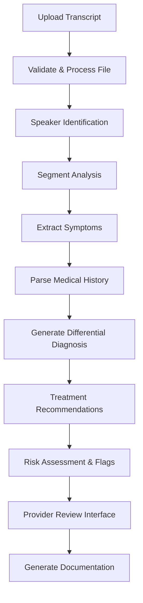

# AI Analysis Workflows Documentation 🤖

*This document outlines the automated AI analysis workflows for the Visit Transcript Analysis & Diagnosis Assistance platform.*

---

## Overview

The Visit Transcript Analysis & AI Diagnosis Assistance platform includes automated workflows that process patient visit transcripts and generate AI-powered clinical insights. These workflows are designed to reduce manual analysis time, improve diagnostic accuracy, and provide evidence-based treatment recommendations while maintaining provider control.

## Architecture Components

### 1. Transcript Processing Pipeline
- **Purpose**: Converts audio recordings to structured text and extracts clinical information
- **Integration**: Supports multiple audio formats and direct text uploads
- **Security**: Implements HIPAA-compliant data handling and encryption

### 2. AI Analysis Engine
- **Model**: OpenAI GPT-4 for advanced medical text analysis
- **Temperature**: 0.2 for consistent, reliable medical outputs
- **Specialization**: Medical-specific prompts for symptom extraction and diagnosis

### 3. Clinical Decision Support
- **Method**: Evidence-based recommendations with confidence scoring
- **Data Sources**: Medical literature, treatment guidelines, drug databases
- **Validation**: Human-in-the-loop provider review and approval

---

## Workflow Diagram



## Workflow Steps

### Step 1: Upload Transcript
- **Input Types**: Audio files (MP3, WAV, M4A, MP4, AAC) or text files (TXT, DOCX, PDF)
- **Validation**: File size limits (50MB audio, 5MB text), format verification
- **Processing**: Audio-to-text conversion using medical-trained speech recognition
- **Security**: Encrypted upload and storage with audit logging

### Step 2: Validate & Process File
- **Audio Processing**: Noise reduction, speaker separation, medical terminology optimization
- **Text Processing**: Format standardization, metadata extraction, quality validation
- **Error Handling**: Retry logic for processing failures, manual review triggers
- **Quality Check**: Confidence scoring for transcription accuracy

### Step 3: Speaker Identification
- **Recognition**: Distinguish between patient and healthcare provider voices
- **Segmentation**: Time-stamped conversation segments
- **Confidence**: Audio quality assessment and speaker clarity scoring
- **Manual Override**: Provider ability to correct speaker assignments

### Step 4: Segment Analysis
- **Classification**: Categorize conversation segments by content type
- **Topics**: History taking, physical exam, symptoms, treatment discussion
- **Tagging**: Automated tagging of relevant medical content
- **Context**: Relationship mapping between related segments

### Step 5: Extract Symptoms
- **AI Processing**: GPT-4 analysis with medical symptom extraction prompts
- **System Prompt**: "You are a medical AI assistant. Extract and categorize symptoms from the patient visit transcript. Identify severity, duration, frequency, and context for each symptom."
- **Output**: Structured symptom data with:
  - Symptom name and description
  - Severity assessment (mild, moderate, severe)
  - Duration and frequency
  - Associated context and triggers
  - Confidence score

### Step 6: Parse Medical History
- **Extraction**: Current medications, allergies, past conditions, family history
- **Validation**: Cross-reference with known medical terminology
- **Categorization**: Organize by relevance to current complaint
- **Documentation**: Source text references for provider verification

### Step 7: Generate Differential Diagnosis
- **AI Analysis**: Medical reasoning with differential diagnosis generation
- **System Prompt**: "Based on the extracted symptoms and patient history, generate a differential diagnosis list with probability scores, supporting evidence, and reasoning for each condition."
- **Output**: Ranked diagnosis options with:
  - Condition name and ICD-10 code
  - Probability score (0-1)
  - Supporting evidence from transcript
  - Contradicting factors
  - Additional tests needed
  - Clinical reasoning

### Step 8: Treatment Recommendations
- **Evidence-Based**: Treatment options based on current medical guidelines
- **Categories**: Medications, procedures, lifestyle interventions, referrals
- **Personalization**: Consider patient history, allergies, contraindications
- **Alternatives**: Multiple treatment approaches with pros and cons

### Step 9: Risk Assessment & Flags
- **Red Flags**: Critical symptoms requiring immediate attention
- **Drug Interactions**: Medication compatibility checking
- **Allergy Alerts**: Contraindication warnings
- **Urgent Referrals**: Specialist consultation recommendations
- **Follow-up**: Required monitoring and next steps

### Step 10: Provider Review Interface
- **Summary Dashboard**: Comprehensive view of AI analysis results
- **Validation Tools**: Easy editing and approval of AI recommendations
- **Confidence Display**: Clear indication of AI certainty levels
- **Source References**: Links back to original transcript segments

### Step 11: Generate Documentation
- **SOAP Notes**: Automated clinical note generation
- **Visit Summary**: Concise overview of key findings
- **Treatment Plan**: Structured care plans with follow-up instructions
- **Export Options**: Multiple formats for EHR integration

---

## AI Analysis Prompts

### Symptom Extraction Prompt
```
You are a medical AI assistant specializing in clinical symptom analysis. 

Analyze the following patient visit transcript and extract all symptoms mentioned by the patient. For each symptom, provide:

1. Symptom name (standardized medical terminology)
2. Severity (mild/moderate/severe) if mentioned
3. Duration (onset and how long present)
4. Frequency (constant, intermittent, specific timing)
5. Context (triggers, relieving factors, associated symptoms)
6. Source text (exact quote from transcript)
7. Confidence score (0.0-1.0) for accuracy of extraction

Format as structured JSON. Only extract symptoms explicitly mentioned by the patient.

Transcript: {transcript_text}
```

### Differential Diagnosis Prompt
```
You are an expert clinician providing differential diagnosis based on patient presentation.

Given the extracted symptoms and patient history below, generate a comprehensive differential diagnosis. For each potential diagnosis:

1. Condition name and ICD-10 code
2. Probability score (0.0-1.0) based on symptom fit
3. Supporting evidence from the case
4. Contradicting factors or missing symptoms
5. Additional tests/workup needed
6. Clinical reasoning (2-3 sentences)

Rank diagnoses by probability and include 5-8 most likely conditions.

Symptoms: {extracted_symptoms}
Patient History: {patient_history}
```

### Treatment Recommendations Prompt
```
You are a clinical decision support AI providing evidence-based treatment recommendations.

Based on the differential diagnosis and patient information, provide treatment recommendations for the most likely conditions. Include:

1. First-line treatments with evidence level
2. Alternative options and their indications
3. Contraindications based on patient history
4. Monitoring requirements
5. Follow-up timeline and specialist referrals
6. Patient education points

Consider patient allergies, current medications, and comorbidities.

Diagnosis: {primary_diagnosis}
Patient Allergies: {allergies}
Current Medications: {medications}
```

---

## Technical Implementation

### Firebase Cloud Functions
```javascript
exports.analyzeTranscript = functions.https.onCall(async (data, context) => {
  // Authenticate user
  if (!context.auth) {
    throw new functions.https.HttpsError('unauthenticated', 'User must be authenticated');
  }
  
  const { visitId, transcriptText } = data;
  
  try {
    // Step 1: Extract symptoms
    const symptoms = await extractSymptoms(transcriptText);
    
    // Step 2: Parse medical history
    const history = await parseHistory(transcriptText);
    
    // Step 3: Generate differential diagnosis
    const diagnosis = await generateDifferential(symptoms, history);
    
    // Step 4: Treatment recommendations
    const treatments = await getTreatmentRecommendations(diagnosis, history);
    
    // Step 5: Risk assessment
    const riskFlags = await assessRisk(symptoms, diagnosis);
    
    // Save analysis results
    const analysis = {
      visitId,
      extractedSymptoms: symptoms,
      patientHistory: history,
      differentialDiagnosis: diagnosis,
      treatmentRecommendations: treatments,
      flaggedConcerns: riskFlags,
      status: 'completed',
      createdAt: admin.firestore.FieldValue.serverTimestamp()
    };
    
    await admin.firestore().collection('ai-analysis').add(analysis);
    
    return { success: true, analysisId: analysis.id };
    
  } catch (error) {
    console.error('Analysis error:', error);
    throw new functions.https.HttpsError('internal', 'Analysis failed');
  }
});

async function extractSymptoms(transcript) {
  const response = await openai.chat.completions.create({
    model: 'gpt-4',
    temperature: 0.2,
    messages: [
      {
        role: 'system',
        content: 'You are a medical AI assistant specializing in clinical symptom analysis...'
      },
      {
        role: 'user',
        content: `Transcript: ${transcript}`
      }
    ]
  });
  
  return JSON.parse(response.choices[0].message.content);
}
```

### Error Handling & Retry Logic
```javascript
const MAX_RETRIES = 3;
const RETRY_DELAY = 1000;

async function withRetry(operation, retries = MAX_RETRIES) {
  try {
    return await operation();
  } catch (error) {
    if (retries > 0 && isRetryableError(error)) {
      await sleep(RETRY_DELAY);
      return withRetry(operation, retries - 1);
    }
    throw error;
  }
}

function isRetryableError(error) {
  return error.code === 'rate_limit_exceeded' || 
         error.code === 'timeout' ||
         error.status === 503;
}
```

---

## Performance Metrics

### Processing Times
- **Audio Transcription**: 2-5 minutes per hour of audio
- **Symptom Extraction**: 30-60 seconds per transcript
- **Differential Diagnosis**: 60-90 seconds
- **Treatment Recommendations**: 30-45 seconds
- **Total Analysis**: 3-7 minutes per visit

### Accuracy Targets
- **Symptom Detection**: >90% sensitivity for mentioned symptoms
- **Diagnosis Relevance**: >85% provider agreement with top 3 diagnoses
- **Treatment Appropriateness**: >95% guideline concordance
- **Red Flag Detection**: >99% sensitivity for critical conditions

### System Reliability
- **Uptime**: 99.9% availability target
- **Error Rate**: <1% processing failures
- **Response Time**: <30 seconds for real-time analysis
- **Concurrent Users**: Support for 100+ simultaneous analyses

---

## Security & Compliance

### HIPAA Compliance
- **Encryption**: AES-256 for data at rest and in transit
- **Access Controls**: Role-based permissions with audit logging
- **De-identification**: PHI anonymization for AI processing when possible
- **Audit Trails**: Comprehensive logging of all data access

### Data Protection
- **Retention**: Configurable data retention policies
- **Backup**: Automated backups with point-in-time recovery
- **Disaster Recovery**: Multi-region redundancy
- **Penetration Testing**: Regular security assessments

---

## Quality Assurance

### AI Model Validation
- **Continuous Monitoring**: Performance tracking against clinical benchmarks
- **Feedback Loop**: Provider corrections improve model accuracy
- **Version Control**: Model versioning with rollback capabilities
- **A/B Testing**: Comparing different AI approaches

### Provider Validation
- **Review Required**: All AI recommendations require provider approval
- **Confidence Thresholds**: Low-confidence results flagged for manual review
- **Override Capability**: Providers can modify or reject AI suggestions
- **Learning Integration**: Provider feedback incorporated into model training

---

This AI analysis workflow provides a comprehensive framework for transforming patient visit transcripts into actionable clinical insights while maintaining the highest standards of accuracy, security, and provider control. 