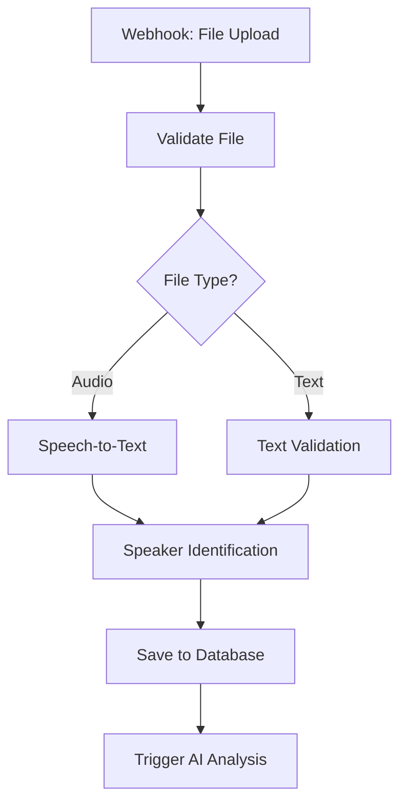

# n8n AI Analysis Workflow Setup Guide 🤖

*Complete setup and configuration guide for n8n AI analysis workflows in the Visit Transcript Analysis & Diagnosis Assistance platform.*

---

## Overview

This guide provides step-by-step instructions for setting up, configuring, and managing n8n workflows for automated AI-powered visit transcript analysis, symptom extraction, differential diagnosis, and treatment recommendations.

## Prerequisites

### System Requirements
- **n8n Version**: 1.0.0 or higher
- **Node.js**: 18.x or higher
- **Memory**: Minimum 4GB RAM (for AI processing)
- **Storage**: 10GB free space (for transcript files)
- **Network**: Stable internet connection for AI API calls

### Required API Keys and Credentials
- **OpenAI API Key**: For GPT-4 medical analysis
- **Firebase Admin SDK**: For database operations and file storage
- **Speech-to-Text API**: Google Cloud or Azure (for audio transcription)
- **Slack Bot Token**: For provider notifications (optional)
- **Email Service**: SendGrid or similar for alerts

---

## Installation and Setup

### 1. Install n8n

#### Option A: Docker (Recommended for AI Workflows)
```bash
# Create n8n AI analysis directory
mkdir n8n-ai-medical-analysis
cd n8n-ai-medical-analysis

# Create docker-compose.yml with increased resources
cat > docker-compose.yml << 'EOF'
version: '3.8'

services:
  n8n:
    image: n8nio/n8n:latest
    restart: unless-stopped
    ports:
      - "5678:5678"
    environment:
      - N8N_BASIC_AUTH_ACTIVE=true
      - N8N_BASIC_AUTH_USER=admin
      - N8N_BASIC_AUTH_PASSWORD=your_secure_password
      - N8N_HOST=localhost
      - N8N_PORT=5678
      - N8N_PROTOCOL=http
      - WEBHOOK_URL=http://localhost:5678/
      - N8N_METRICS=true
      - N8N_DEFAULT_EXECUTION_TIMEOUT=1800
      - N8N_MAX_EXECUTION_TIMEOUT=3600
    volumes:
      - n8n_data:/home/node/.n8n
      - ./transcript-files:/tmp/transcripts
    deploy:
      resources:
        limits:
          memory: 4G
        reservations:
          memory: 2G

volumes:
  n8n_data:
    driver: local
EOF

# Start n8n
docker-compose up -d
```

#### Option B: NPM Installation
```bash
# Install n8n globally
npm install -g n8n

# Set environment variables for AI processing
export N8N_DEFAULT_EXECUTION_TIMEOUT=1800
export N8N_MAX_EXECUTION_TIMEOUT=3600

# Start n8n
n8n start

# Access at http://localhost:5678
```

### 2. Initial Configuration

1. **Access n8n Interface**: Open http://localhost:5678
2. **Create Admin Account**: Set up your admin credentials
3. **Configure AI Settings**:
   - Set timezone to your healthcare facility's timezone
   - Configure webhook base URL
   - Set up execution timeout (1800 seconds for AI processing)
   - Enable error workflows for failed AI analyses

---

## Credential Configuration

### 1. OpenAI Credentials

1. Go to **Settings** → **Credentials**
2. Click **Add Credential**
3. Select **OpenAI**
4. Enter your OpenAI API key
5. Test the connection with a simple prompt
6. Save as "OpenAI-Medical-AI"

### 2. Firebase Admin SDK

1. Add new credential
2. Select **Google Service Account**
3. Upload your Firebase Admin SDK JSON file
4. Configure project settings
5. Test database connection
6. Save as "Firebase-Medical-DB"

### 3. Google Cloud Speech-to-Text

1. Add new credential
2. Select **Google Cloud**
3. Upload service account JSON
4. Configure speech API settings
5. Test with sample audio
6. Save as "Google-Speech-AI"

### 4. Azure Cognitive Services (Alternative)

1. Add new credential
2. Select **HTTP Header Auth**
3. Add header: `Ocp-Apim-Subscription-Key: {your-key}`
4. Configure endpoint URL
5. Save as "Azure-Speech-AI"

---

## Core AI Analysis Workflows

### 1. Transcript Processing Workflow

#### Workflow Overview


#### Node Configuration

**Webhook Trigger Node**
```json
{
  "parameters": {
    "httpMethod": "POST",
    "path": "transcript-upload",
    "responseMode": "onReceived",
    "options": {
      "rawBody": true,
      "allowedOrigins": "https://your-app-domain.com"
    }
  }
}
```

**File Validation Node**
```javascript
// JavaScript code for file validation
const MAX_FILE_SIZE = 50 * 1024 * 1024; // 50MB
const ALLOWED_AUDIO_TYPES = ['audio/mp3', 'audio/wav', 'audio/m4a', 'audio/mp4'];
const ALLOWED_TEXT_TYPES = ['text/plain', 'application/pdf', 'application/vnd.openxmlformats-officedocument.wordprocessingml.document'];

const file = $input.first().json;
const fileSize = file.size;
const fileType = file.type;

if (fileSize > MAX_FILE_SIZE) {
  throw new Error('File size exceeds 50MB limit');
}

if (!ALLOWED_AUDIO_TYPES.includes(fileType) && !ALLOWED_TEXT_TYPES.includes(fileType)) {
  throw new Error('Unsupported file type');
}

return [{
  json: {
    ...file,
    isAudio: ALLOWED_AUDIO_TYPES.includes(fileType),
    isText: ALLOWED_TEXT_TYPES.includes(fileType),
    validated: true
  }
}];
```

**Speech-to-Text Node (Google Cloud)**
```json
{
  "parameters": {
    "authentication": "serviceAccount",
    "resource": "speech",
    "operation": "recognize",
    "options": {
      "config": {
        "encoding": "MP3",
        "sampleRateHertz": 16000,
        "languageCode": "en-US",
        "model": "medical_conversation",
        "useEnhanced": true,
        "enableSpeakerDiarization": true,
        "diarizationSpeakerCount": 2
      },
      "audio": {
        "content": "={{ $json.audioBase64 }}"
      }
    }
  }
}
```

### 2. AI Analysis Workflow

#### Symptom Extraction Node
```json
{
  "parameters": {
    "model": "gpt-4",
    "temperature": 0.2,
    "maxTokens": 2000,
    "messages": [
      {
        "role": "system",
        "content": "You are a medical AI assistant specializing in clinical symptom analysis. Extract all symptoms mentioned by the patient from the visit transcript. For each symptom, provide: 1) Symptom name (standardized medical terminology), 2) Severity (mild/moderate/severe) if mentioned, 3) Duration (onset and how long present), 4) Frequency (constant, intermittent, specific timing), 5) Context (triggers, relieving factors, associated symptoms), 6) Source text (exact quote from transcript), 7) Confidence score (0.0-1.0) for accuracy of extraction. Format as structured JSON. Only extract symptoms explicitly mentioned by the patient."
      },
      {
        "role": "user",
        "content": "Transcript: {{ $json.transcript }}"
      }
    ]
  }
}
```

#### Medical History Parsing Node
```json
{
  "parameters": {
    "model": "gpt-4",
    "temperature": 0.2,
    "maxTokens": 1500,
    "messages": [
      {
        "role": "system",
        "content": "You are a medical AI assistant. Extract medical history from the patient visit transcript. Identify and categorize: 1) Current medications with dosages, 2) Known allergies and reactions, 3) Past medical conditions and surgeries, 4) Family history of diseases, 5) Social history (smoking, alcohol, exercise), 6) Review of systems findings. Format as structured JSON with confidence scores for each extraction."
      },
      {
        "role": "user",
        "content": "Transcript: {{ $json.transcript }}"
      }
    ]
  }
}
```

#### Differential Diagnosis Node
```json
{
  "parameters": {
    "model": "gpt-4",
    "temperature": 0.3,
    "maxTokens": 2500,
    "messages": [
      {
        "role": "system",
        "content": "You are an expert clinician providing differential diagnosis based on patient presentation. Given the extracted symptoms and patient history, generate a comprehensive differential diagnosis. For each potential diagnosis provide: 1) Condition name and ICD-10 code, 2) Probability score (0.0-1.0) based on symptom fit, 3) Supporting evidence from the case, 4) Contradicting factors or missing symptoms, 5) Additional tests/workup needed, 6) Clinical reasoning (2-3 sentences). Rank diagnoses by probability and include 5-8 most likely conditions."
      },
      {
        "role": "user",
        "content": "Symptoms: {{ $node['Symptom Extraction'].json.symptoms }}\nPatient History: {{ $node['Medical History'].json.history }}"
      }
    ]
  }
}
```

#### Treatment Recommendations Node
```json
{
  "parameters": {
    "model": "gpt-4",
    "temperature": 0.2,
    "maxTokens": 2000,
    "messages": [
      {
        "role": "system",
        "content": "You are a clinical decision support AI providing evidence-based treatment recommendations. Based on the differential diagnosis and patient information, provide treatment recommendations for the most likely conditions. Include: 1) First-line treatments with evidence level, 2) Alternative options and their indications, 3) Contraindications based on patient history, 4) Monitoring requirements, 5) Follow-up timeline and specialist referrals, 6) Patient education points. Consider patient allergies, current medications, and comorbidities."
      },
      {
        "role": "user",
        "content": "Diagnosis: {{ $node['Differential Diagnosis'].json.primaryDiagnosis }}\nPatient Allergies: {{ $node['Medical History'].json.allergies }}\nCurrent Medications: {{ $node['Medical History'].json.medications }}"
      }
    ]
  }
}
```

#### Risk Assessment Node
```json
{
  "parameters": {
    "model": "gpt-4",
    "temperature": 0.1,
    "maxTokens": 1500,
    "messages": [
      {
        "role": "system",
        "content": "You are a medical safety AI assistant. Analyze the patient case for critical red flags and safety concerns. Identify: 1) Red flag symptoms requiring immediate attention, 2) Drug interactions and contraindications, 3) Allergy concerns with proposed treatments, 4) Urgent specialist referrals needed, 5) Critical monitoring requirements. For each concern, provide: severity level (low/medium/high/critical), immediate action required, and clinical reasoning. Prioritize patient safety above all."
      },
      {
        "role": "user",
        "content": "Symptoms: {{ $node['Symptom Extraction'].json.symptoms }}\nDiagnosis: {{ $node['Differential Diagnosis'].json.diagnoses }}\nTreatments: {{ $node['Treatment Recommendations'].json.treatments }}\nHistory: {{ $node['Medical History'].json.history }}"
      }
    ]
  }
}
```

### 3. Data Storage and Notification Workflow

#### Save Analysis Results Node (Firebase)
```javascript
// JavaScript code to save analysis results
const analysisData = {
  visitId: $json.visitId,
  patientId: $json.patientId,
  timestamp: new Date().toISOString(),
  extractedSymptoms: $node['Symptom Extraction'].json.symptoms,
  medicalHistory: $node['Medical History'].json.history,
  differentialDiagnosis: $node['Differential Diagnosis'].json.diagnoses,
  treatmentRecommendations: $node['Treatment Recommendations'].json.treatments,
  riskAssessment: $node['Risk Assessment'].json.risks,
  status: 'completed',
  aiModel: 'gpt-4',
  processingTime: Date.now() - $json.startTime,
  confidenceScore: calculateOverallConfidence($node['Symptom Extraction'].json, $node['Differential Diagnosis'].json)
};

// Save to Firestore
const docRef = await $firebase.firestore().collection('ai-analysis').add(analysisData);

return [{
  json: {
    ...analysisData,
    analysisId: docRef.id,
    success: true
  }
}];

function calculateOverallConfidence(symptoms, diagnoses) {
  const symptomConfidence = symptoms.reduce((sum, s) => sum + s.confidence, 0) / symptoms.length;
  const diagnosisConfidence = diagnoses.reduce((sum, d) => sum + d.probability, 0) / diagnoses.length;
  return (symptomConfidence + diagnosisConfidence) / 2;
}
```

#### Provider Notification Node
```json
{
  "parameters": {
    "authentication": "predefinedCredentialType",
    "nodeCredentialType": "slackApi",
    "resource": "message",
    "operation": "post",
    "channel": "#provider-notifications",
    "text": "🔬 AI Analysis Complete\n\n📋 Patient: {{ $json.patientId }}\n🎯 Top Diagnosis: {{ $node['Differential Diagnosis'].json.primaryDiagnosis }}\n📊 Confidence: {{ Math.round($json.confidenceScore * 100) }}%\n⚠️ Risk Flags: {{ $node['Risk Assessment'].json.criticalFlags.length }}\n\n👉 Review at: https://your-app.com/analysis/{{ $json.analysisId }}"
  }
}
```

---

## Error Handling and Monitoring

### 1. Error Workflow Setup

Create a separate error handling workflow:

```javascript
// Error categorization and handling
const error = $json.error;
const workflowId = $json.workflowId;
const nodeId = $json.nodeId;

let errorCategory = 'unknown';
let retryable = false;
let notificationLevel = 'info';

if (error.message.includes('rate limit')) {
  errorCategory = 'rate_limit';
  retryable = true;
  notificationLevel = 'warning';
} else if (error.message.includes('timeout')) {
  errorCategory = 'timeout';
  retryable = true;
  notificationLevel = 'warning';
} else if (error.message.includes('OpenAI')) {
  errorCategory = 'ai_service';
  retryable = true;
  notificationLevel = 'error';
} else if (error.message.includes('Firebase')) {
  errorCategory = 'database';
  retryable = false;
  notificationLevel = 'critical';
}

// Log error to database
await $firebase.firestore().collection('error-logs').add({
  timestamp: new Date().toISOString(),
  workflowId,
  nodeId,
  errorCategory,
  errorMessage: error.message,
  retryable,
  notificationLevel
});

return [{
  json: {
    errorCategory,
    retryable,
    notificationLevel,
    errorMessage: error.message
  }
}];
```

### 2. Performance Monitoring

```javascript
// Performance metrics collection
const metrics = {
  timestamp: new Date().toISOString(),
  workflowId: $json.workflowId,
  totalProcessingTime: $json.endTime - $json.startTime,
  nodeMetrics: {
    speechToText: $node['Speech-to-Text'].json.processingTime,
    symptomExtraction: $node['Symptom Extraction'].json.processingTime,
    differentialDiagnosis: $node['Differential Diagnosis'].json.processingTime,
    treatmentRecommendations: $node['Treatment Recommendations'].json.processingTime,
    riskAssessment: $node['Risk Assessment'].json.processingTime
  },
  aiTokensUsed: calculateTotalTokens(),
  confidenceScores: {
    symptoms: $node['Symptom Extraction'].json.avgConfidence,
    diagnosis: $node['Differential Diagnosis'].json.avgProbability,
    overall: $json.overallConfidence
  }
};

// Save metrics for analysis
await $firebase.firestore().collection('performance-metrics').add(metrics);

return [{ json: metrics }];
```

---

## Production Deployment

### 1. Environment Configuration

```bash
# Production environment variables
export N8N_HOST=your-domain.com
export N8N_PROTOCOL=https
export N8N_PORT=443
export N8N_BASIC_AUTH_ACTIVE=false  # Use proper authentication
export N8N_JWT_AUTH_ACTIVE=true
export N8N_ENCRYPTION_KEY=your-secure-encryption-key
export WEBHOOK_URL=https://your-domain.com/
export N8N_METRICS=true
export N8N_LOG_LEVEL=info
export N8N_DEFAULT_EXECUTION_TIMEOUT=1800
export N8N_MAX_EXECUTION_TIMEOUT=3600
```

### 2. Docker Production Setup

```yaml
version: '3.8'

services:
  n8n:
    image: n8nio/n8n:latest
    restart: unless-stopped
    environment:
      - N8N_HOST=${N8N_HOST}
      - N8N_PROTOCOL=https
      - N8N_PORT=443
      - WEBHOOK_URL=https://${N8N_HOST}/
      - N8N_JWT_AUTH_ACTIVE=true
      - N8N_ENCRYPTION_KEY=${N8N_ENCRYPTION_KEY}
      - N8N_METRICS=true
      - N8N_LOG_LEVEL=info
      - N8N_DEFAULT_EXECUTION_TIMEOUT=1800
    volumes:
      - n8n_data:/home/node/.n8n
      - /etc/ssl/certs:/etc/ssl/certs:ro
    labels:
      - "traefik.enable=true"
      - "traefik.http.routers.n8n.rule=Host(`${N8N_HOST}`)"
      - "traefik.http.routers.n8n.tls=true"
      - "traefik.http.routers.n8n.tls.certresolver=letsencrypt"
    deploy:
      resources:
        limits:
          memory: 8G
        reservations:
          memory: 4G

  traefik:
    image: traefik:v2.9
    command:
      - "--api.insecure=true"
      - "--providers.docker=true"
      - "--entrypoints.web.address=:80"
      - "--entrypoints.websecure.address=:443"
      - "--certificatesresolvers.letsencrypt.acme.httpchallenge=true"
      - "--certificatesresolvers.letsencrypt.acme.httpchallenge.entrypoint=web"
      - "--certificatesresolvers.letsencrypt.acme.email=your-email@domain.com"
      - "--certificatesresolvers.letsencrypt.acme.storage=/letsencrypt/acme.json"
    ports:
      - "80:80"
      - "443:443"
    volumes:
      - "/var/run/docker.sock:/var/run/docker.sock:ro"
      - "letsencrypt_data:/letsencrypt"

volumes:
  n8n_data:
  letsencrypt_data:
```

### 3. Security Configuration

```javascript
// IP allowlist for webhook endpoints
const ALLOWED_IPS = [
  '192.168.1.0/24',    // Internal network
  '10.0.0.0/8',        // Private network
  'your-app-server-ip'  // Application server
];

const clientIP = $request.headers['x-forwarded-for'] || $request.connection.remoteAddress;

if (!isIPAllowed(clientIP, ALLOWED_IPS)) {
  $response.status(403).json({ error: 'Access denied' });
  return;
}

function isIPAllowed(ip, allowedRanges) {
  // Implementation for IP range checking
  return allowedRanges.some(range => {
    if (range.includes('/')) {
      return isIPInCIDR(ip, range);
    }
    return ip === range;
  });
}
```

---

## Troubleshooting

### Common Issues

1. **AI API Rate Limits**
   - Implement exponential backoff
   - Use multiple API keys with load balancing
   - Monitor usage and set alerts

2. **Large File Processing**
   - Chunk audio files for processing
   - Implement streaming for real-time analysis
   - Use compression for transcript storage

3. **Memory Issues**
   - Increase Docker container memory
   - Optimize JSON payload sizes
   - Implement garbage collection

4. **Network Timeouts**
   - Increase timeout values for AI nodes
   - Implement retry logic with delays
   - Use webhook responses for long-running processes

### Monitoring and Alerts

```javascript
// Health check endpoint
const healthCheck = {
  timestamp: new Date().toISOString(),
  services: {
    openai: await checkOpenAIHealth(),
    firebase: await checkFirebaseHealth(),
    speechToText: await checkSpeechAPIHealth()
  },
  metrics: {
    activeWorkflows: await getActiveWorkflowCount(),
    avgProcessingTime: await getAverageProcessingTime(),
    errorRate: await getErrorRate()
  }
};

// Alert if any service is down or performance degrades
if (healthCheck.services.openai === false || 
    healthCheck.metrics.errorRate > 0.05 ||
    healthCheck.metrics.avgProcessingTime > 300) {
  
  await sendAlert({
    level: 'critical',
    message: 'AI Analysis Pipeline Health Check Failed',
    details: healthCheck
  });
}

return [{ json: healthCheck }];
```

---

This comprehensive setup guide enables robust, scalable AI-powered visit transcript analysis with proper error handling, monitoring, and production deployment capabilities. 