# Wireflow Diagrams 🎨

*Visual user flow diagrams for the Visit Transcript Analysis & AI Diagnosis Assistance platform showing key user journeys and interface interactions.*

---

## Overview

This document contains wireflow diagrams that map out the complete user experience for healthcare providers using the AI-powered visit transcript analysis application. These diagrams show the flow between screens, decision points, and key interactions for efficient clinical decision-making.

## User Flow Legend

```
🏥 = Entry Point
🎤 = Audio/Transcript Upload
🤖 = AI Processing
📋 = Data Review/Edit
✅ = Validation/Approval
⚠️ = Alert/Risk Flag
🔄 = Process/Analysis
📤 = Output/Export
👤 = Provider Decision
🎯 = End Goal
🔍 = Search/Filter
```

---

## 1. Visit Transcript Upload Flow

### Primary User: Healthcare Provider

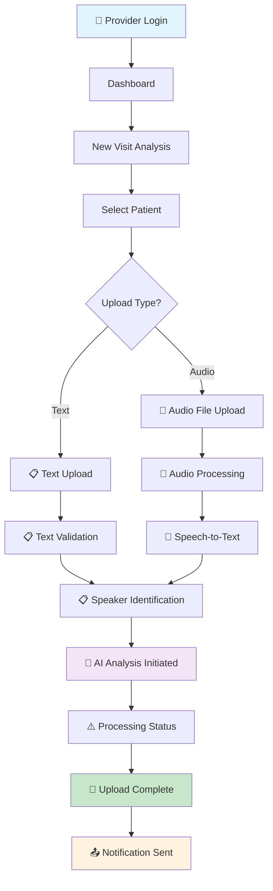

### File Validation Flow

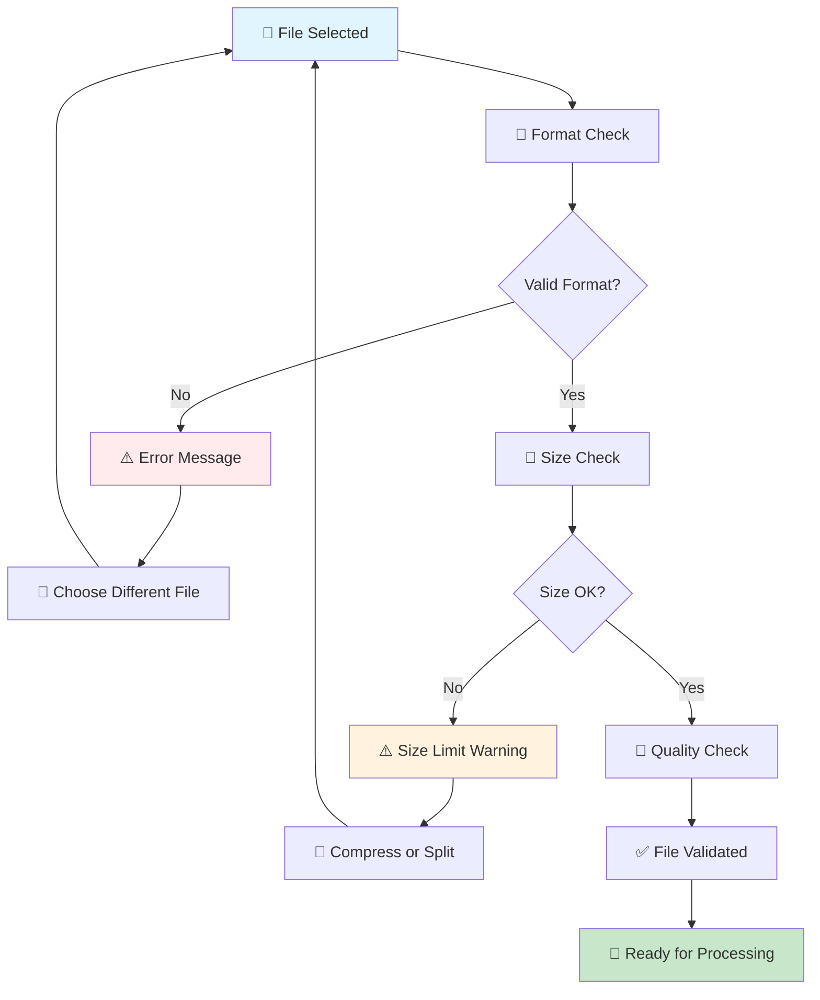

---

## 2. AI Analysis Processing Flow

### Automated Analysis Pipeline

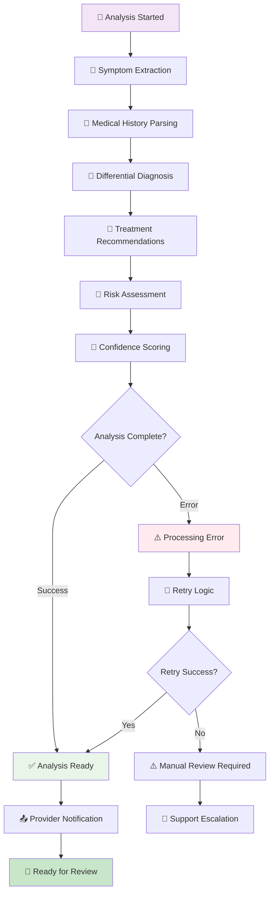

### Real-time Processing Status

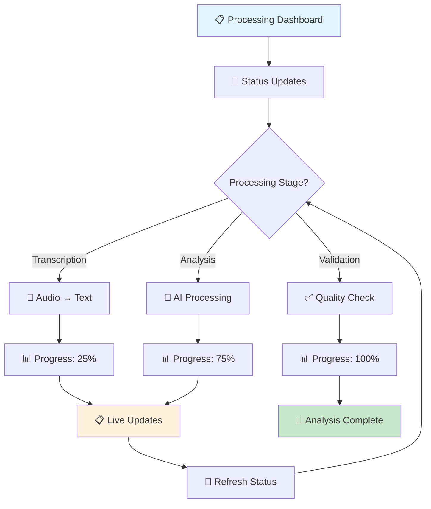

---

## 3. AI Analysis Review Flow

### Primary User: Healthcare Provider

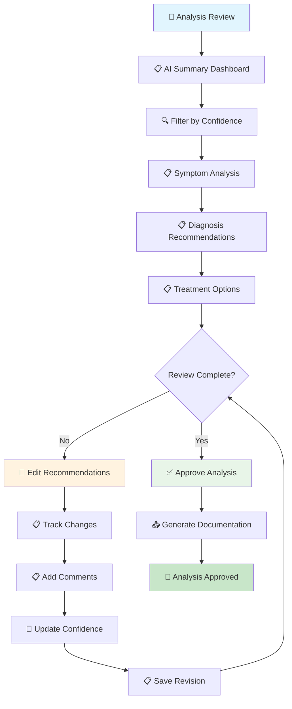

### Split-Screen Review Interface

```mermaid
flowchart TD
    A[📋 AI Analysis] --> B[📋 Original Transcript]
    B --> C[🔍 Click Source Text]
    C --> D[📋 Highlight in Analysis]
    D --> E[📊 Show Confidence Score]
    E --> F{Confidence Level?}
    F -->|High (>0.8)| G[✅ Auto-Approve Option]
    F -->|Medium (0.5-0.8)| H[⚠️ Review Recommended]
    F -->|Low (<0.5)| I[⚠️ Manual Review Required]
    G --> J[👤 One-Click Approval]
    H --> K[👤 Detailed Review]
    I --> L[👤 Edit Required]
    J --> M[✅ Approved]
    K --> N[👤 Approve/Edit Decision]
    L --> O[📋 Make Corrections]
    M --> P[🎯 Section Complete]
    N --> Q{Approve?}
    O --> R[📋 Update Analysis]
    Q -->|Yes| M
    Q -->|No| L
    R --> S[🔄 Recalculate Confidence]
    S --> P
    
    style A fill:#e3f2fd
    style B fill:#f1f8e9
    style P fill:#c8e6c9
    style I fill:#ffebee
```

---

## 4. Risk Assessment & Alerts Flow

### Critical Finding Detection

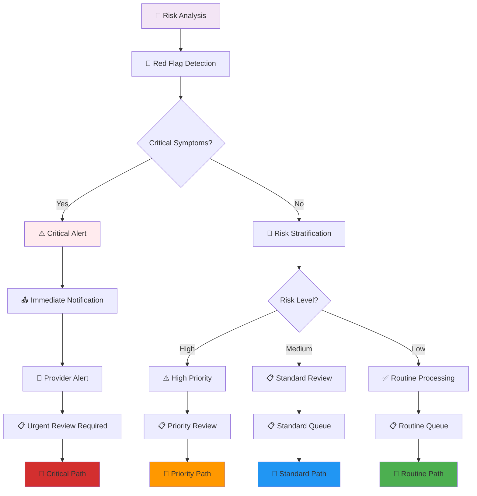

### Drug Interaction Alerts

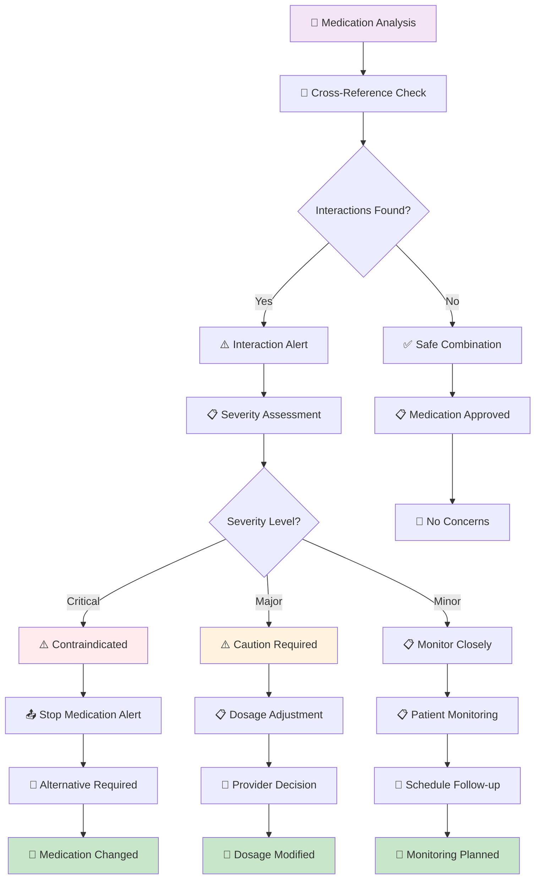

---

## 5. Documentation Generation Flow

### Automated Note Creation

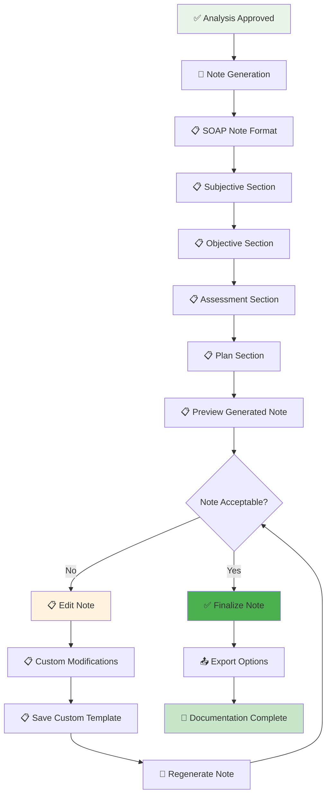

### Multiple Format Export

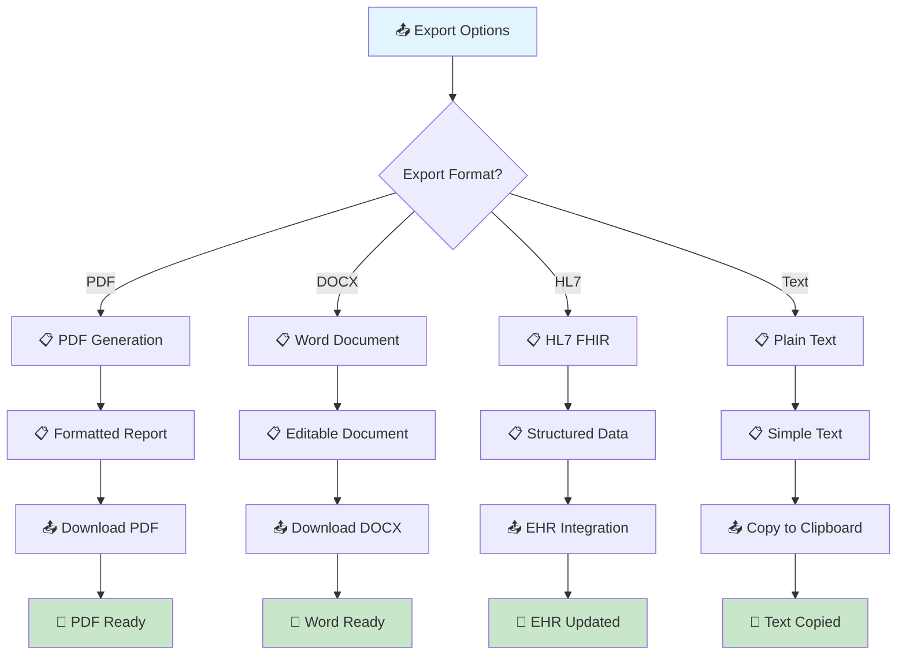

---

## 6. Provider Dashboard Flow

### Multi-Visit Management

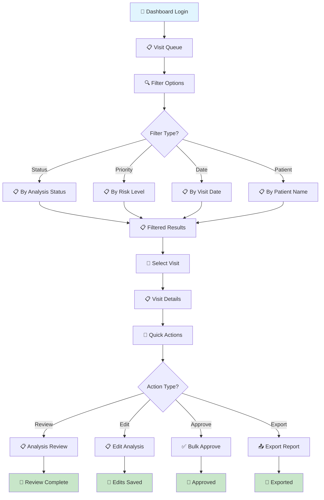

### Performance Analytics

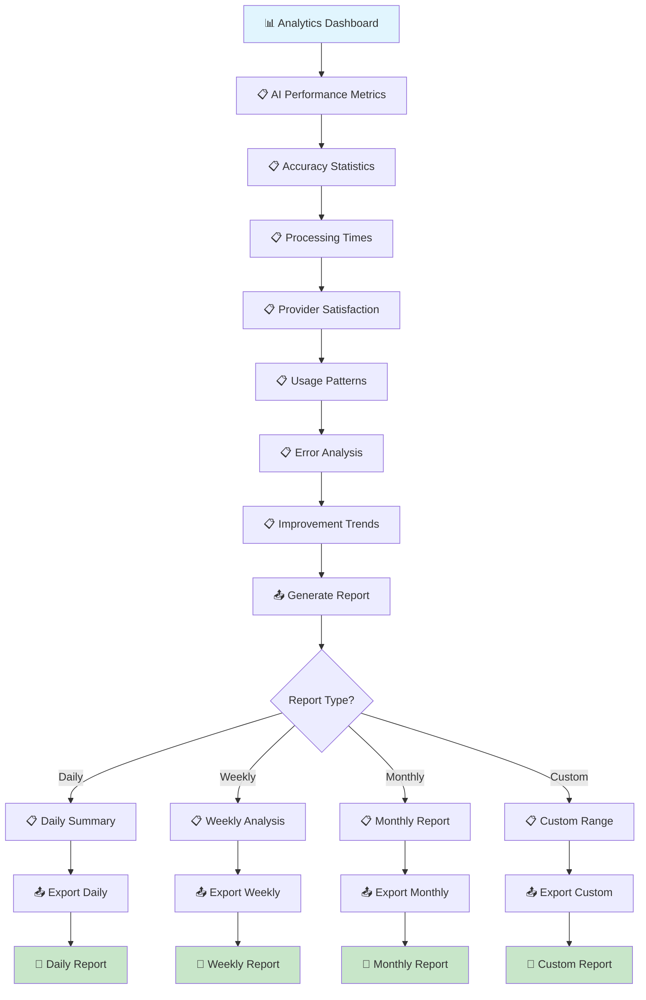

---

## 7. Complete AI Analysis Journey

### End-to-End Workflow

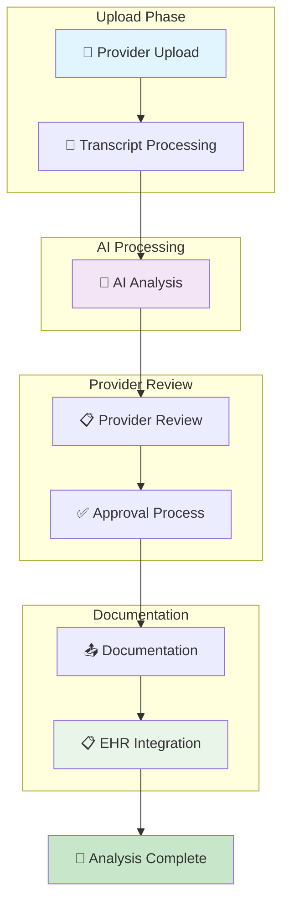

---

## 8. Error Handling & Recovery Flows

### System Error Recovery

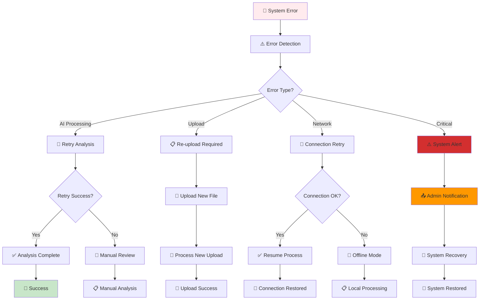

---

## 9. Mobile/Tablet Interface Flow

### Responsive Design Adaptations

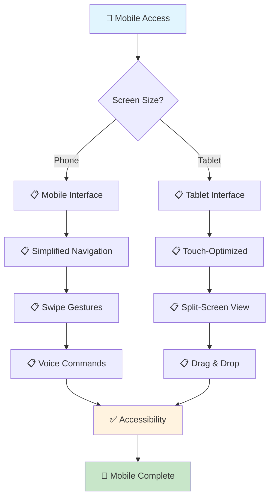

---

## 10. Integration & Compliance Flow

### EHR Integration Path

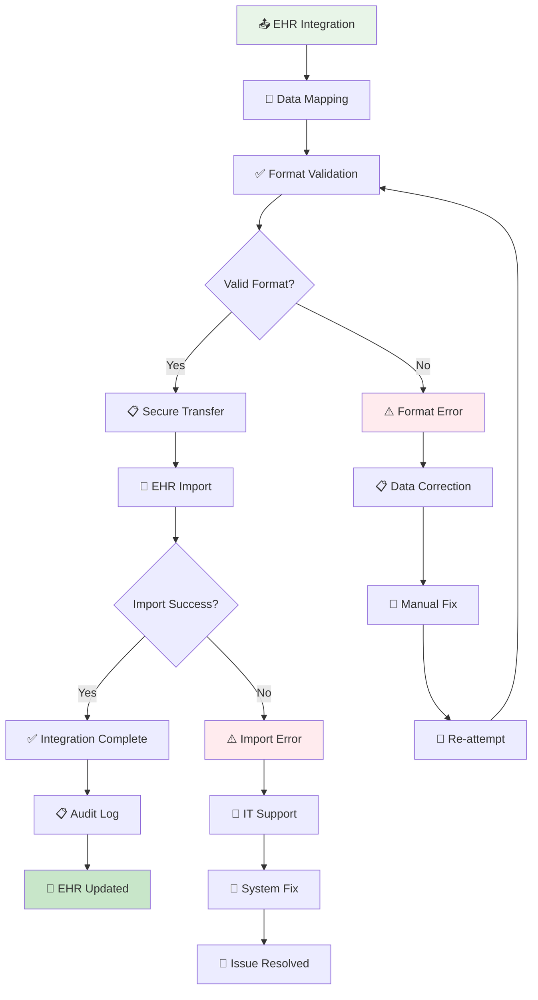

---

## Implementation Guidelines

### Design Principles for AI Workflows

1. **Transparency**: Always show AI confidence levels and reasoning
2. **Provider Control**: Maintain human oversight at all decision points
3. **Efficiency**: Minimize clicks and cognitive load
4. **Safety**: Include multiple validation and error-checking layers
5. **Flexibility**: Allow customization of workflows and preferences
6. **Accessibility**: Ensure compliance with healthcare accessibility standards
7. **Security**: Implement HIPAA-compliant data handling throughout
8. **Scalability**: Design for high-volume processing and multiple users

### Next Steps

1. **Create detailed wireframes** for each AI analysis screen
2. **Develop interactive prototypes** based on these wireflows
3. **User testing** with healthcare providers in real clinical settings
4. **Iterate based on clinical feedback** and usage patterns
5. **Technical implementation** following AI-first design principles

These wireflow diagrams serve as the foundation for developing an AI-powered healthcare platform that enhances clinical decision-making while maintaining the highest standards of patient safety and provider satisfaction. 