# Wireflow Diagrams 🎨

*Visual user flow diagrams for the Pre-Examination Charting Agent showing key user journeys and interface interactions.*

---

## Overview

This document contains wireflow diagrams that map out the complete user experience for different personas using the medical charting application. These diagrams show the flow between screens, decision points, and key interactions.

## User Flow Legend

```
🏥 = Entry Point
📋 = Data Entry
✅ = Validation/Review
⚠️ = Alert/Warning
🔄 = Process/Automation
📤 = Output/Export
👤 = User Decision
🎯 = End Goal
```

---

## 1. Patient Screening Flow

### Primary User: Patient (Self-Service Kiosk)

```mermaid
flowchart TD
    A[🏥 Patient Arrives] --> B[Scan QR Code/Enter ID]
    B --> C[Welcome Screen]
    C --> D[Demographics Review]
    D --> E{Information Correct?}
    E -->|No| F[📋 Update Demographics]
    E -->|Yes| G[📋 Medical History]
    F --> G
    G --> H[📋 Current Medications]
    H --> I[📋 Allergies & Reactions]
    I --> J[📋 Social History]
    J --> K[📋 Family History]
    K --> L[📋 Review & Confirm]
    L --> M{Ready to Submit?}
    M -->|No| N[👤 Go Back to Edit]
    M -->|Yes| O[✅ Submit Screening]
    N --> G
    O --> P[🎯 Screening Complete]
    P --> Q[Print Summary]
    Q --> R[Direct to Waiting Area]
    
    style A fill:#e1f5fe
    style P fill:#c8e6c9
    style O fill:#fff3e0
```

### Alternative Flow: Nurse-Assisted Entry

```mermaid
flowchart TD
    A[🏥 Nurse Login] --> B[Patient Search]
    B --> C{Patient Found?}
    C -->|No| D[📋 New Patient Registration]
    C -->|Yes| E[Select Patient]
    D --> F[📋 Complete Demographics]
    E --> G[📋 Screening Interview]
    F --> G
    G --> H[📋 Review Responses]
    H --> I[✅ Validate & Save]
    I --> J[⚠️ Flag High-Risk Items]
    J --> K[🎯 Screening Complete]
    K --> L[Notify Provider]
    
    style A fill:#e1f5fe
    style K fill:#c8e6c9
    style J fill:#ffebee
```

---

## 2. Vitals Capture Flow

### Primary User: Nurse

```mermaid
flowchart TD
    A[🏥 Nurse Station Login] --> B[Patient Queue]
    B --> C[Select Patient]
    C --> D[📋 Vitals Entry Form]
    D --> E[Blood Pressure]
    E --> F[Heart Rate]
    F --> G[Temperature]
    G --> H[Respiratory Rate]
    H --> I[Oxygen Saturation]
    I --> J[Weight/Height]
    J --> K[Pain Scale]
    K --> L[✅ Real-time Validation]
    L --> M{Values Normal?}
    M -->|⚠️ Abnormal| N[Alert Notification]
    M -->|✅ Normal| O[Save Vitals]
    N --> P[👤 Provider Notification]
    O --> Q[📤 Print Vitals Summary]
    P --> Q
    Q --> R[🎯 Vitals Complete]
    R --> S[Update Patient Status]
    
    style A fill:#e1f5fe
    style R fill:#c8e6c9
    style N fill:#ffebee
    style P fill:#fff3e0
```

### Device Integration Flow

```mermaid
flowchart TD
    A[🔄 Device Connection] --> B[Auto-Import Vitals]
    B --> C[✅ Data Validation]
    C --> D{Data Quality OK?}
    D -->|No| E[Manual Entry Required]
    D -->|Yes| F[Auto-Populate Fields]
    E --> G[📋 Manual Input]
    F --> H[✅ Review & Confirm]
    G --> H
    H --> I[Save to Patient Record]
    I --> J[🎯 Vitals Recorded]
    
    style A fill:#e8f5e8
    style J fill:#c8e6c9
    style E fill:#fff3e0
```

---

## 3. AI Draft Verification Flow

### Primary User: Nurse

```mermaid
flowchart TD
    A[🏥 Nurse Review Queue] --> B[Select Patient Visit]
    B --> C[🔄 AI Draft Generation]
    C --> D[📋 Generated HPI/ROS]
    D --> E[Source Data Panel]
    E --> F[Confidence Scores]
    F --> G{Review Complete?}
    G -->|No| H[📋 Edit Draft]
    G -->|Yes| I[✅ Approve Draft]
    H --> J[Track Changes]
    J --> K[📋 Add Comments]
    K --> L[Save Revision]
    L --> M[🔄 Re-generate Summary]
    M --> G
    I --> N[📤 Forward to Provider]
    N --> O[🎯 Note Verified]
    
    style A fill:#e1f5fe
    style O fill:#c8e6c9
    style C fill:#f3e5f5
    style I fill:#c8e6c9
```

### Split-Screen Interface Flow

```mermaid
flowchart TD
    A[📋 Generated Note] --> B[📋 Source Data]
    B --> C[Click Source Item]
    C --> D[Highlight in Note]
    D --> E[Show Confidence Score]
    E --> F{Confidence High?}
    F -->|Low| G[⚠️ Review Required]
    F -->|High| H[✅ Auto-Approve Option]
    G --> I[👤 Manual Review]
    H --> J[One-Click Approval]
    I --> K[Edit if Needed]
    J --> L[✅ Approved]
    K --> L
    L --> M[🎯 Section Complete]
    
    style A fill:#e3f2fd
    style B fill:#f1f8e9
    style G fill:#ffebee
    style H fill:#c8e6c9
```

---

## 4. Provider Review Flow

### Primary User: Doctor

```mermaid
flowchart TD
    A[🏥 Provider Login] --> B[Patient Dashboard]
    B --> C[Review Queue]
    C --> D[Select Patient]
    D --> E[📋 Screening Summary]
    E --> F[📋 Vitals Review]
    F --> G[📋 Nurse Notes]
    G --> H[📋 AI-Generated HPI]
    H --> I{Accept HPI?}
    I -->|No| J[📋 Edit Note]
    I -->|Yes| K[✅ Approve Note]
    J --> L[📋 Add Assessment]
    K --> L
    L --> M[📋 Plan & Orders]
    M --> N[✅ Final Review]
    N --> O[📤 Sign & Submit]
    O --> P[🎯 Chart Complete]
    P --> Q[🔄 Notify Nursing]
    
    style A fill:#e1f5fe
    style P fill:#c8e6c9
    style O fill:#fff3e0
    style Q fill:#e8f5e8
```

---

## 5. Automation Workflow Monitoring

### Primary User: System Administrator

```mermaid
flowchart TD
    A[🏥 Admin Dashboard] --> B[Workflow Status]
    B --> C[🔄 n8n Monitor]
    C --> D{Workflows Running?}
    D -->|Error| E[⚠️ Error Alerts]
    D -->|Success| F[✅ Performance Metrics]
    E --> G[📋 Error Logs]
    F --> H[📋 Success Rates]
    G --> I[👤 Troubleshoot]
    H --> J[📋 Performance Report]
    I --> K[🔄 Restart Workflow]
    J --> L[📤 Export Metrics]
    K --> M[✅ Monitor Recovery]
    L --> N[🎯 Report Complete]
    M --> N
    
    style A fill:#e1f5fe
    style N fill:#c8e6c9
    style E fill:#ffebee
    style F fill:#c8e6c9
```

---

## 6. Complete Patient Journey Flow

### Multi-User Workflow

```mermaid
flowchart TD
    A[🏥 Patient Arrival] --> B[📋 Self-Service Screening]
    B --> C[🔄 Nurse Notification]
    C --> D[📋 Vitals Collection]
    D --> E[🔄 AI Note Generation]
    E --> F[📋 Nurse Verification]
    F --> G[📤 Provider Notification]
    G --> H[📋 Provider Review]
    H --> I[✅ Chart Completion]
    I --> J[🔄 EHR Update]
    J --> K[📤 Discharge Planning]
    K --> L[🎯 Patient Discharge]
    
    subgraph "Patient Actions"
        B
    end
    
    subgraph "Nurse Actions"
        D
        F
    end
    
    subgraph "Provider Actions"
        H
        I
    end
    
    subgraph "System Actions"
        C
        E
        G
        J
    end
    
    style A fill:#e1f5fe
    style L fill:#c8e6c9
    style E fill:#f3e5f5
    style J fill:#e8f5e8
```

---

## 7. Error Handling & Recovery Flows

### System Error Recovery


---

## 8. Mobile/Tablet Responsive Flows

### Touch Interface Adaptations

```mermaid
flowchart TD
    A[📱 Mobile Access] --> B{Device Type?}
    B -->|Phone| C[📋 Simplified Interface]
    B -->|Tablet| D[📋 Full Interface]
    C --> E[📋 Essential Functions Only]
    D --> F[📋 Complete Functionality]
    E --> G[📋 Swipe Navigation]
    F --> H[📋 Touch Optimized]
    G --> I[📋 Large Touch Targets]
    H --> I
    I --> J[✅ Accessibility Features]
    J --> K[🎯 Mobile Complete]
    
    style A fill:#e1f5fe
    style K fill:#c8e6c9
    style J fill:#fff3e0
```

---

## 9. Integration Points Flow

### External System Connections

```mermaid
flowchart TD
    A[🔄 Data Input] --> B{Integration Type?}
    B -->|EHR| C[📤 HL7 FHIR]
    B -->|Device| D[📤 Device API]
    B -->|Lab| E[📤 Lab Interface]
    C --> F[🔄 Data Mapping]
    D --> G[🔄 Real-time Sync]
    E --> H[🔄 Results Import]
    F --> I[✅ Validation]
    G --> I
    H --> I
    I --> J{Data Valid?}
    J -->|Yes| K[📋 Auto-Update]
    J -->|No| L[⚠️ Error Handling]
    K --> M[🎯 Integration Complete]
    L --> N[📋 Manual Review]
    N --> O[👤 Data Correction]
    O --> M
    
    style A fill:#e8f5e8
    style M fill:#c8e6c9
    style L fill:#ffebee
```

---

## 10. Accessibility & Compliance Flows

### WCAG Compliance Path

```mermaid
flowchart TD
    A[👤 User with Disability] --> B[🔧 Accessibility Features]
    B --> C{Accommodation Type?}
    C -->|Visual| D[📋 Screen Reader]
    C -->|Motor| E[📋 Keyboard Navigation]
    C -->|Cognitive| F[📋 Simplified Interface]
    D --> G[🔊 Audio Feedback]
    E --> H[⌨️ Tab Navigation]
    F --> I[📋 Clear Instructions]
    G --> J[✅ Alternative Text]
    H --> K[✅ Focus Indicators]
    I --> L[✅ Error Messages]
    J --> M[🎯 Accessible Complete]
    K --> M
    L --> M
    
    style A fill:#e1f5fe
    style M fill:#c8e6c9
    style B fill:#fff3e0
```

---

## Implementation Guidelines

### Design Principles for Wireflows

1. **Clear Visual Hierarchy**: Use consistent symbols and colors
2. **Decision Points**: Clearly mark user decision points with diamond shapes
3. **Error States**: Always show error handling and recovery paths
4. **Responsive Design**: Consider mobile and tablet variations
5. **Accessibility**: Include accessibility considerations in all flows
6. **Performance**: Indicate loading states and async operations
7. **Integration**: Show external system touchpoints
8. **Compliance**: Include audit trails and compliance checkpoints

### Next Steps

1. **Create detailed wireframes** for each key screen
2. **Develop prototypes** based on these wireflows
3. **User testing** with healthcare professionals
4. **Iterate based on feedback**
5. **Technical implementation** following the flows

These wireflow diagrams serve as the foundation for detailed UI/UX design and development planning, ensuring all user journeys are considered and optimized for healthcare workflows. 